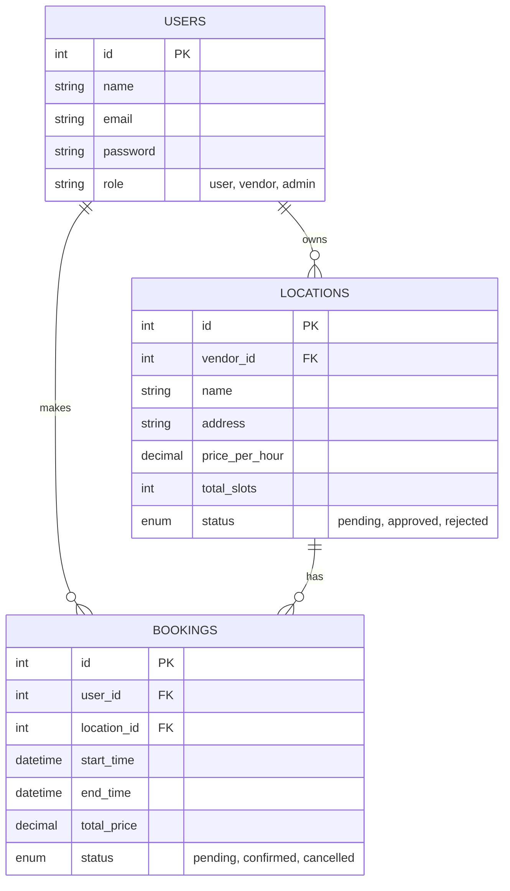
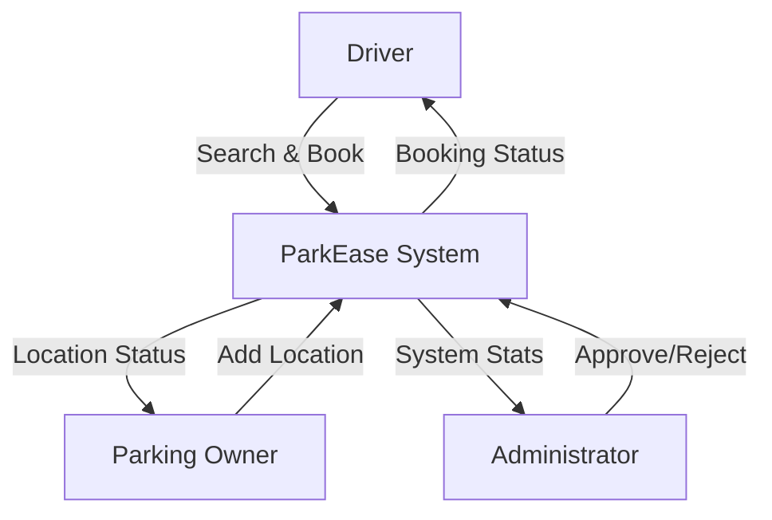

# ParkEase - System Architecture

This document provides a detailed technical overview of the ParkEase system, including diagrams and file structure.

## 1. Project Structure
```
/third-parkease
├── assets/                 # CSS, JS, and image resources
├── backend/                # Server-side logic
│   ├── config/             # Database configuration
│   ├── controllers/        # Business logic (Auth, Location, Booking, Admin)
│   ├── models/             # Database interaction classes
│   ├── router.php          # API Entry point
│   └── utils/              # Helper scripts
├── database.sql            # Database schema definition
├── index.html              # Landing page
├── login.html              # Authentication page
├── dashboard_user.html     # User Dashboard
├── dashboard_vendor.html   # Vendor Dashboard
└── dashboard_admin.html    # Admin Dashboard
```

## 2. Entity Relationship Diagram (ERD)



## 3. Data Flow Diagram (DFD) - Level 0



## 4. Database Schema Structure
The system uses a relational MySQL database with the following table definitions used in `database.sql`:

### `users` table
- **Purpose**: Manages authentication and user roles.
- **Key Columns**: `id` (Primary Key), `email` (Unique), `role` (Enum: user/vendor/admin).

### `locations` table
- **Purpose**: Stores parking spot details managed by vendors.
- **Relationships**: Linked to `users` via `vendor_id`.
- **Status**: Columns `status` allows Admin moderation.

### `bookings` table
- **Purpose**: Records reservations made by drivers.
- **Relationships**: Linked to `users` (driver) and `locations`.
